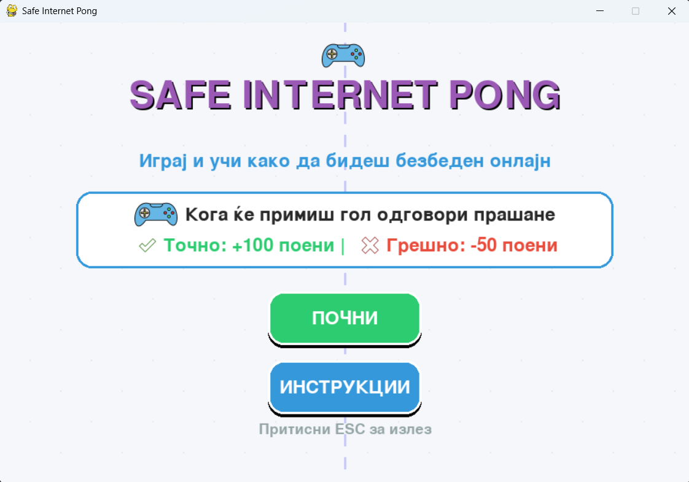

# 🎮 Safe Internet Pong

**Safe Internet Pong** е едукативна 2D игра направена со **Python** и **Pygame**.
Играчот игра класичен Pong, но истовремено одговара на прашања за **безбедно користење на интернет** 🛡️🌐

---

## 🧠 Цел на играта

* 📚 Да научиш основи за интернет безбедност
* ⭐ Да освоиш поени со точни одговори
* ❤️ Да избегнеш губење животи

---

## 🎮 Како се игра

* ⬆️⬇️ Користи **W** и **S** за движење на левата пандалка
* 🏓 Не дозволувај топчето да помине
* ❓ Кога ќе примиш гол – одговараш на прашање (**Безбедно / Не безбедно**)
* ✅ Точен одговор → **+100 поени + бонус**
* ❌ Погрешен одговор → **-50 поени + казна**

---

## 💡 Направено со

* 🐍 Python
* 🎨 Pygame

---

✨ Направено за учење и забава!
Ако ти се допаѓа играта – слободно подобри ја или додај нови прашања 😊
---
---
# 🎮 Safe Internet Pong

**Safe Internet Pong** is an educational 2D game built with **Python** and **Pygame**.
Players enjoy a classic Pong experience while answering questions about **safe internet usage** 🛡️🌐

---

## 🧠 Game Objective

* 📚 Learn the basics of internet safety
* ⭐ Earn points by answering questions correctly
* ❤️ Avoid losing lives

---

## 🎮 How to Play

* ⬆️⬇️ Use **W** and **S** to move the left paddle
* 🏓 Don’t let the ball pass your paddle
* ❓ When you concede a goal – answer a question (**Safe / Not Safe**)
* ✅ Correct answer → **+100 points + bonus**
* ❌ Wrong answer → **-50 points + penalty**

---

## 💡 Built With

* 🐍 Python
* 🎨 Pygame

---

✨ Created for learning and fun!
Feel free to improve the game or add more questions 😊
---
### Download the game
https://naumvlavceski.itch.io/safe-internet-pong

### Video

### Made by
* 226093 Наум Влавчески
* 211142 Али Шупани
* 225017 Надиа Лабринеа

